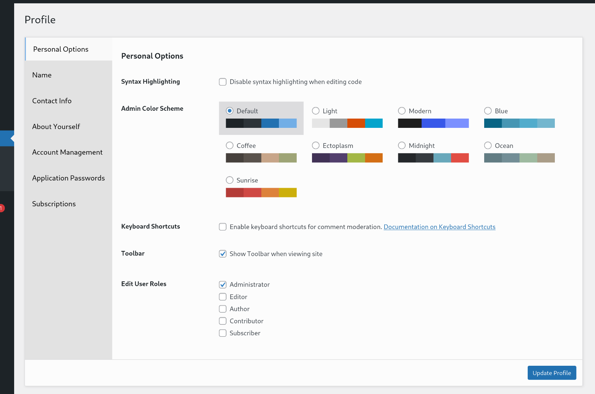
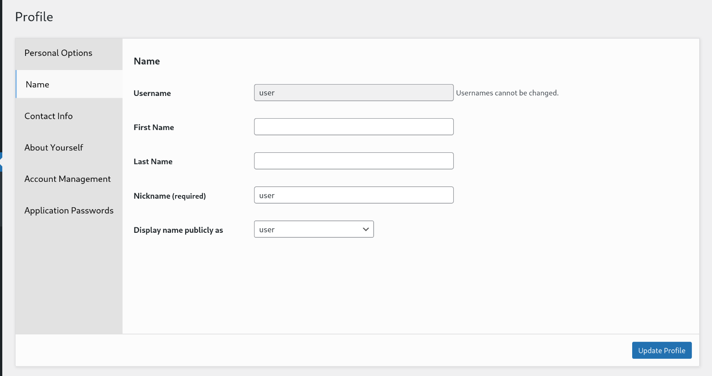

# User Profile Tabs

[![WordPress Plugin Version][shield-version]][plugin-page] [![WordPress Plugin Stars][shield-stars]][plugin-page] [![GitHub CI Test Result][shield-ci]][github-ci-url]

![banner][plugin-banner]

Organize the user profile form with tabs.

If your User Profile page is way too stuffed with fields (e.g. from Paid Membership Pro),
this plugin will inject CSS and Javascripts to them into sensible tabs.

## Features

* All fields in the user profile from, sectioned by H2 or H3, will be organized into tabs by javascript.
* Javascript only re-organizes the fields. The attached javascript listeners are not touched.
* Easy to use. Just works.

## Links

* [Plugin Page][plugin-page]
* [GitHub Repository][github-repo]

## Screenshots

How the User Profile page would look with this plugin activated:

## Support

If you find this useful, please show some support:

[![Buy me a pizza][button-buymeacoffie]][url-buymeacoffie]

[url-buymeacoffie]: https://buymeacoffee.com/yookoala
[button-buymeacoffie]: https://cdn.buymeacoffee.com/buttons/v2/default-blue.png

[plugin-icon]: .wordpress-org/icon-128x128.png
[plugin-banner]: .wordpress-org/banner-1544x500.png
[plugin-page]: https://wordpress.org/plugins/user-profile-tabs/
[github-repo]: https://github.com/yookoala/user-profile-tabs
[github-ci-url]: https://github.com/yookoala/user-profile-tabs/actions/workflows/ci.yml
[shield-stars]: https://img.shields.io/wordpress/plugin/stars/user-profile-tabs
[shield-version]: https://img.shields.io/wordpress/plugin/v/user-profile-tabs?label=WordPress%20Plugin
[shield-ci]: https://github.com/yookoala/user-profile-tabs/actions/workflows/ci.yml/badge.svg

## License

This software is licensed under the MIT License. You can obtain a copy of the agreement [here](LICENSE.md).
